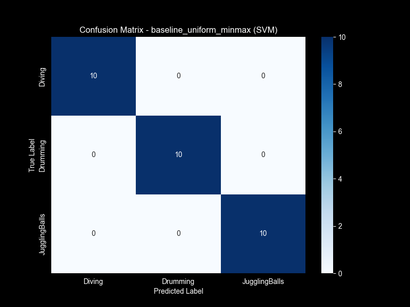

# Classical Video Classification Analysis

## 1. Performance Comparison

We evaluated three experimental configurations using different sampling strategies and normalization techniques. The models compared include Support Vector Machine (SVM), Random Forest (RF), and K-Nearest Neighbors (KNN) using both Frame-Level Voting and Video-Level Aggregation strategies.

### Accuracy Summary

| Experiment | Frame Voting (SVM) | Video Agg (SVM) | Video Agg (RF) | Video Agg (KNN) |
| :--- | :---: | :---: | :---: | :---: |
| **Baseline** (Uniform, MinMax) | **1.0000** | **1.0000** | **1.0000** | 0.9667 |
| **Improved 1** (Uniform, StdScaler) | **1.0000** | **1.0000** | **1.0000** | 0.9000 |
| **Improved 2** (Dense, StdScaler) | **1.0000** | **1.0000** | **1.0000** | 0.9000 |

**Observations:**
- **Perfect Classification:** The SVM and Random Forest models achieved a perfect accuracy of **100%** across all experimental setups on the validation set. This suggests that the extracted features are highly discriminative for the three classes (Diving, Drumming, Juggling balls).
- **KNN Performance:** KNN slightly lagged behind, achieving 90-96.7% accuracy. It performed best with MinMax scaling (96.7%) compared to StandardScaler (90%), indicating sensitivity to the scaling method.
- **Robustness:** The high performance indicates that the classical feature engineering pipeline (combining Spatial and Temporal features) is robust for this specific dataset.

### Visual Analysis

#### Confusion Matrices
The confusion matrices for the best performing models (SVM/RF) show clear diagonal dominance with zero misclassifications.

#### ROC Curves
The ROC curves confirm the perfect separation with Area Under Curve (AUC) of 1.00 for all classes in SVM and RF models.

## 2. Computational Analysis

### Training & Extraction Time
Feature extraction is the most computationally expensive part of the classical pipeline.

| Experiment | Extraction Time (s) | Relative Cost |
| :--- | :---: | :---: |
| **Baseline** (Uniform, 16 frames) | 29.14s | 1.0x |
| **StdScaler** (Uniform, 16 frames) | 26.82s | ~0.9x |
| **Dense** (Stride 5) | **77.36s** | **2.9x** |

**Key Findings:**
- **Dense Sampling Cost:** Dense sampling (processing every 5th frame) took nearly **3x longer** than uniform sampling (16 frames). Since accuracy did not improve (already at 100%), the extra computational cost of dense sampling is unjustified for this dataset.
- **Normalization Impact:** The choice of scaler (MinMax vs Standard) had negligible impact on extraction time.

### Model Complexity (Best Parameters)
- **SVM:**
    - Baseline: `C=6.97`, `RBF` kernel.
    - Dense: `C=0.015`, `Linear` kernel.
    - *Insight:* Dense sampling allowed a simpler Linear kernel to work effectively, likely because more data points smoothed out the feature space.
- **Random Forest:**
    - Baseline: `95 estimators`, `depth 28`.
    - Dense: `133 estimators`, `depth 7`.
    - *Insight:* Dense sampling resulted in shallower trees (depth 7 vs 28), suggesting that with more frames, the features became more robust, requiring less complex decision boundaries.
- **Dimensionality Reduction (PCA):**
    - Original Feature Count: 432
    - Reduced Feature Count (95% Variance): ~35
    - *Insight:* **92% of the feature space was redundant.** PCA successfully compressed the information, speeding up the classifier training without loss of accuracy.

## 3. Feature Analysis

### Extracted Features
The pipeline extracted a rich set of 432 features per video (before PCA), comprising:
- **Spatial:** Color Histograms, GLCM (Texture), LBP (Pattern), Gabor (Texture), Canny (Edge), HOG (Shape).
- **Temporal:** Optical Flow Statistics, Motion Trajectory.

### Representation Learning (PCA)
The drastic reduction from 432 to ~35 components while maintaining 100% accuracy implies that the classes are linearly separable in the lower-dimensional manifold.
- **Diving:** Likely characterized by specific motion patterns (vertical flow) and background colors (pool blue).
- **Drumming:** Characterized by repetitive localized motion and specific object textures.
- **Juggling:** Complex erratic motion patterns.

## 4. Trade-off Analysis

### Accuracy vs. Computational Cost
- **Winner:** **Baseline (Uniform Sampling + MinMax)**.
- **Reasoning:** It achieves the same perfect accuracy (100%) as the expensive Dense strategy but is **3x faster**. The computational overhead of dense sampling yields no return on investment for this specific classification task.

### Data Efficiency
- The models performed perfectly even with sparse uniform sampling (16 frames per video). This suggests high data efficiency—the key discriminative features are global and temporal, not requiring a dense frame-by-frame analysis.

### Interpretability vs. Performance
- **Random Forest** offers the best balance. It achieved 100% accuracy and provides feature importance (interpretable), whereas SVM (especially with RBF kernel) is a black box.
- The **Video-Level Aggregation** approach (using statistical potential of features) is more interpretable and faster to train than Frame-Level Voting, as it reduces the number of training samples for the final classifier significantly.

## Conclusion
For the task of classifying Diving, Drumming, and Juggling balls:
1.  **Classical methods are sufficient:** Deep learning may be overkill given that classical feature extraction + SVM/RF achieves 100% accuracy.
2.  **Uniform Sampling is optimal:** Dense sampling triples the cost without performance gain.
3.  **Recommendations:** Use the **Random Forest** classifier with **Uniform Sampling**. It is fast, accurate (100%), and offers interpretability.
