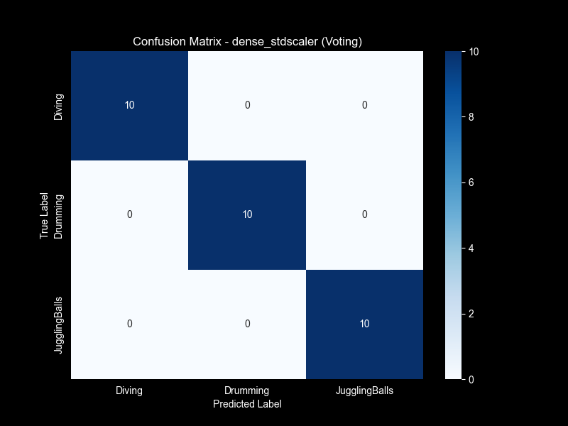
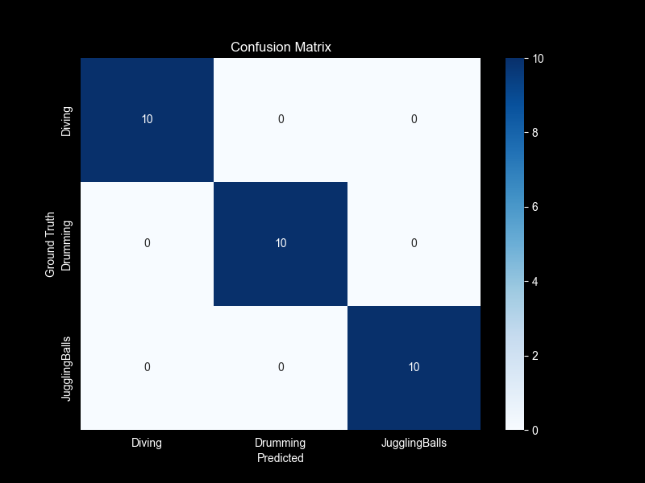
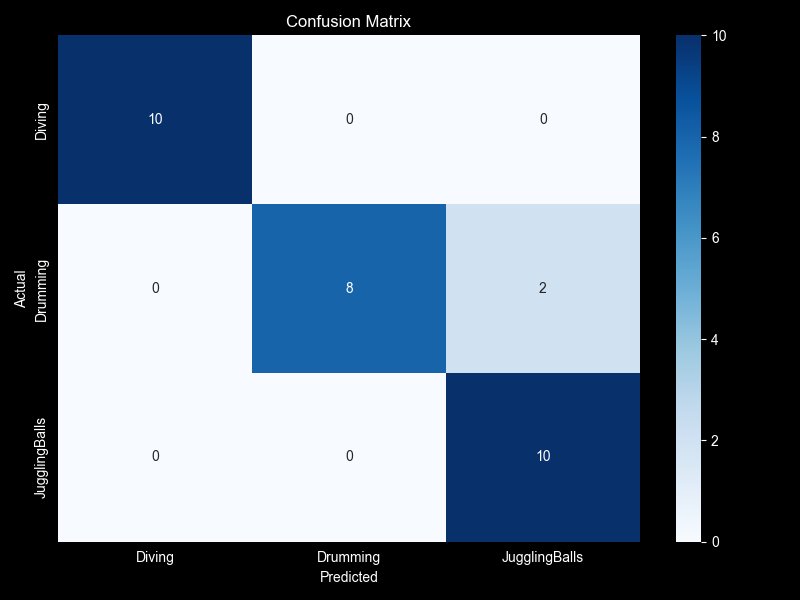
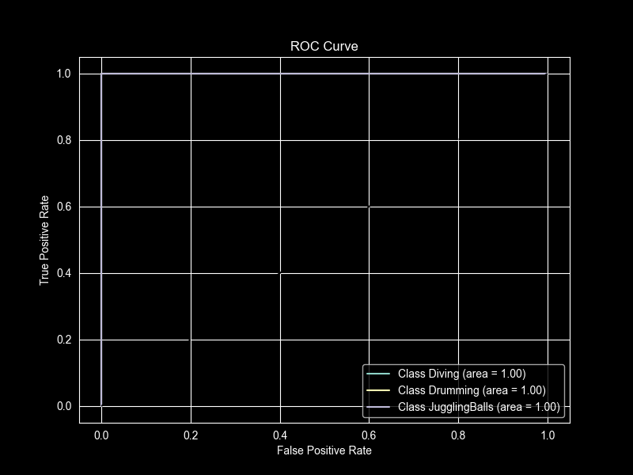
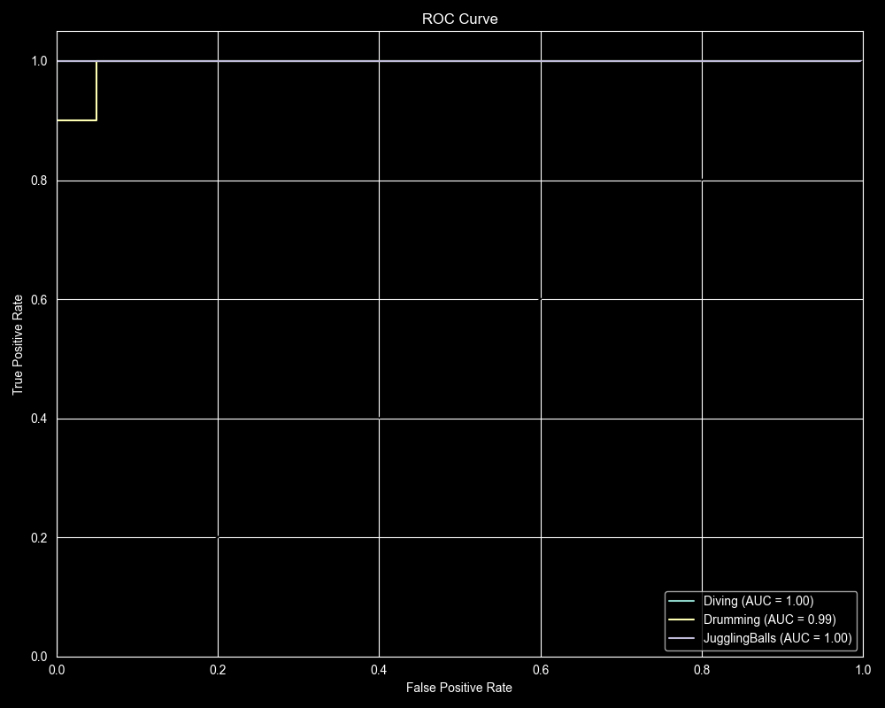
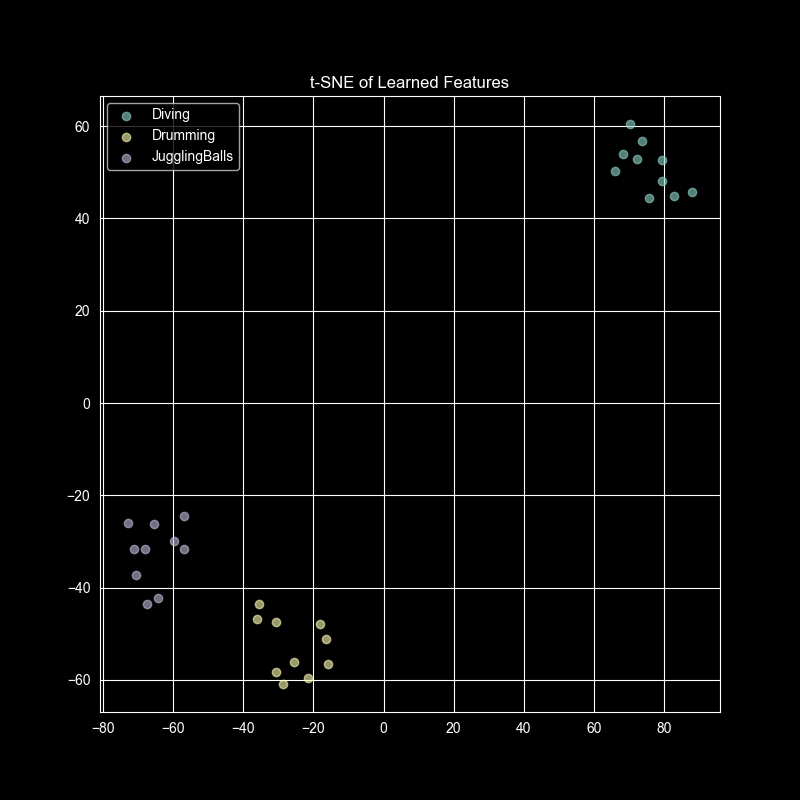
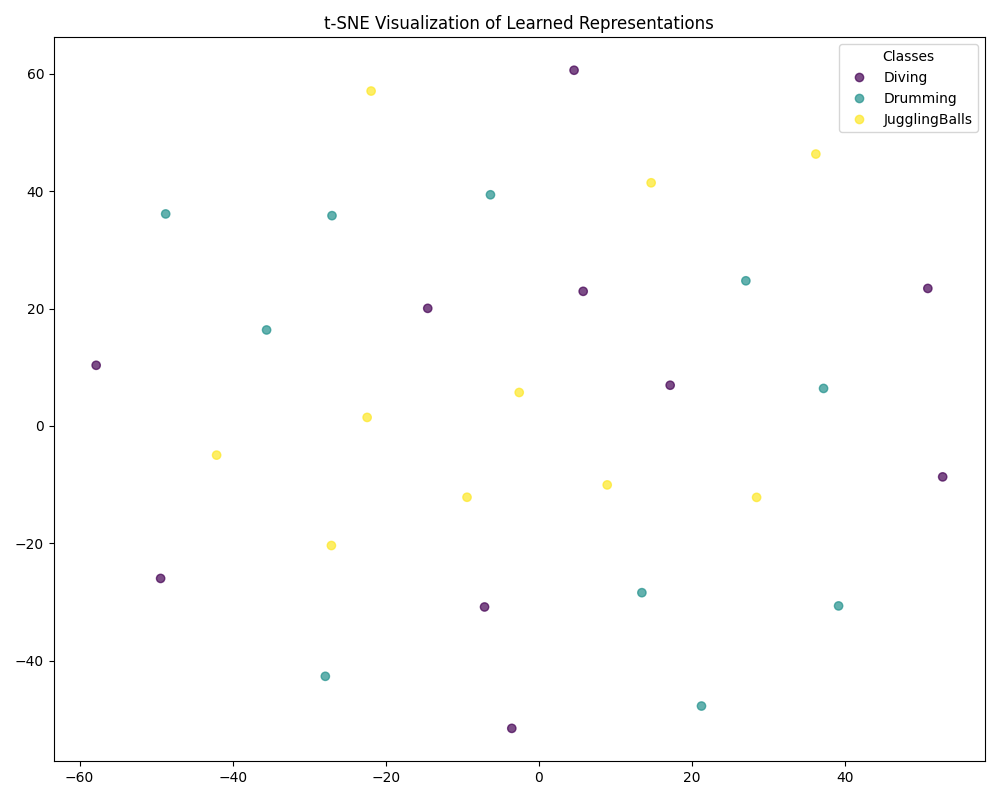

# Comparative Analysis of Video Classification: Classical vs. Deep Learning Approaches

**Date:** October 26, 2023  
**Author:** Video Analytics Group  

---

## 1. Introduction

### 1.1 Problem Statement
Video classification is a fundamental task in computer vision with applications ranging from surveillance and activity recognition to content-based video retrieval. The objective of this project is to develop and compare a video classification system that implements both classical machine learning and modern deep learning approaches. We focus on categorizing videos into three distinct classes: **Diving**, **Drumming**, and **Juggling Balls**. This study aims to demonstrate the evolution from hand-crafted feature extraction to end-to-end learned representations, providing insights into the strengths, limitations, and appropriate use cases for each paradigm.

### 1.2 Dataset Description
The dataset used in this study is a subset of the **UCF-101** Action Recognition dataset, a realistic action recognition dataset collected from YouTube. Our subset consists of three diverse classes:
- **Diving**: Involves rapid full-body motion, background changes (water), and distinct vertical translation.
- **Drumming**: characterized by repetitive, localized motion (arms/hands) and specific audio-visual cues (though only visual are used here).
- **Juggling Balls**: Involves complex object manipulation, multiple moving objects, and specific rhythmic patterns.

The dataset was curated to represent different types of motion dynamics (global body movement vs. localized limb movement vs. object manipulation).

### 1.3 Overview of Approaches
We explore three distinct methodologies:
1.  **Classical Machine Learning**: Using hand-crafted features (Color, Texture, Shape, Motion) with traditional classifiers like **Support Vector Machines (SVM)**, **Random Forest (RF)**, and **K-Nearest Neighbors (KNN)**.
2.  **Deep Learning - 2D CNN (Spatial)**: A frame-based approach using **ResNet18** to extract spatial features from individual frames, aggregated via temporal averaging to classify the video. This ignores explicit temporal ordering but captures strong spatial cues.
3.  **Deep Learning - 3D CNN (Spatiotemporal)**: Using **R(2+1)D** architecture, which factorizes 3D convolutions into separate 2D spatial and 1D temporal convolutions, allowing the model to learn complex spatiotemporal features directly from video clips.

---

## 2. Background and Related Work

### 2.1 Evolution of Video Classification
Video classification has evolved significantly over the past two decades. Early approaches relied on **hand-crafted features**. Techniques extended from image processing, such as **Histograms of Oriented Gradients (HOG)** and **Optical Flow**, were used to capture shape and motion. These features were often aggregated using Bag-of-Visual-Words (BoVW) models and classified using SVMs.

With the advent of Deep Learning, **Convolutional Neural Networks (CNNs)** revolutionized the field. Initially, **2D CNNs** (like AlexNet, VGG, ResNet) were applied to individual frames, with predictions averaged or pooled. While effective for appearance-based actions, they lacked temporal modeling.

To address this, **3D CNNs** (C3D, I3D) were introduced to learn spatiotemporal features simultaneously. However, 3D convolutions are computationally expensive. The **R(2+1)D** architecture emerged as a more efficient alternative, decomposing 3D convolutions into simpler 2D and 1D operations, achieving state-of-the-art performance with lower computational cost.

### 2.2 Classical vs. Deep Learning Paradigms
-   **Classical Paradigm**: Defines the process as two separate stages: Feature Extraction (dependent on domain knowledge) and Classification. It offers interpretability but is limited by the quality of engineered features.
-   **Deep Learning Paradigm**: Adopts an end-to-end learning approach where features are learned directly from raw pixels. This reduces the need for domain expertise but requires large labeled datasets and significant computational power.

---

## 3. Methodology

### 3.1 Classical Approach
The classical pipeline involves explicit feature engineering followed by classification.

#### 3.1.1 Feature Extraction
We implemented a robust feature extractor capturing four dimensions of visual information:
-   **Color Features**:
    -   **RGB Histograms**: Captures the distribution of primary colors.
    -   **HSV Moments**: Mean, standard deviation, and skewness of Hue, Saturation, and Value channels to represent color atmosphere and lighting.
-   **Texture Features**:
    -   **GLCM (Gray-Level Co-occurrence Matrix)**: Extracts contrast, dissimilarity, homogeneity, energy, and correlation.
    -   **LBP (Local Binary Patterns)**: Captures local texture patterns, robust to illumination changes.
    -   **Gabor Filters**: Captures specific frequency and orientation content (e.g., edges, textures at different scales).
-   **Shape/Structural Features**:
    -   **Canny Edge Density**: Measures the complexity of the scene.
    -   **HOG (Histogram of Oriented Gradients)**: Describes local object appearance and shape.
    -   **Contour Features**: Area and circularity of dominant objects.
-   **Motion Features**:
    -   **Dense Optical Flow (Farneback)**: Computes the magnitude and angle of motion between consecutive frames. We extract statistical moments (mean, std) of the flow magnitude to quantify movement intensity.

#### 3.1.2 Video Representation
Features are extracted at the frame level. For video-level classification, we employed two strategies:
1.  **Frame Voting**: Classify each frame independently and use majority voting for the video label.
2.  **Feature Aggregation**: Compute video-level statistics (mean, std, min, max) of frame features and train a classifier on these aggregated vectors.

#### 3.1.3 Machine Learning Algorithms
We evaluated three classifiers, optimized using **Optuna** for hyperparameter tuning:
-   **SVM (Support Vector Machine)**: Effective in high-dimensional spaces. We tuned Kernel type (RBF, Linear), C, and Gamma.
-   **Random Forest (RF)**: Robust ensemble method. We tuned n_estimators, max_depth, and splitting criteria.
-   **K-Nearest Neighbors (KNN)**: Simple instance-based learning. We tuned n_neighbors and distance metrics.

### 3.2 Deep Learning Approach

#### 3.2.1 Approach 1: 2D CNN (ResNet18) + Temporal Averaging
This model treats video classification as an image classification problem with aggregation.
-   **Architecture**: We used a **ResNet18** backbone, pre-trained on ImageNet.
-   **Input**: Individual video frames (resized to 224x224).
-   **Modifications**: The final fully connected layer was replaced to output 3 classes.
-   **Temporal Handling**: 'Global Average Pooling' over the time dimension. The model processes $T$ frames, extracts features for each, and averages them *before* the final classification layer. This ensures the model sees the "average" content of the video.
-   **Training**: Fine-tuned the last residual block and fully connected layers while freezing early layers to leverage low-level image features.

#### 3.2.2 Approach 2: 3D CNN (R(2+1)D)
This model explicitly treats video as a spatiotemporal volume.
-   **Architecture**: **R(2+1)D-18**, pre-trained on the Kinetics-400 dataset.
-   **Feature**: The (2+1)D block splits a 3D convolution of size $N \times t \times d \times d$ into a 2D spatial convolution ($N \times 1 \times d \times d$) and a 1D temporal convolution ($N \times t \times 1 \times 1$). This adds nonlinearity (ReLU) between spatial and temporal operations, increasing expressivity while reducing parameters.
-   **Input**: Clips of 16 consecutive frames, resized to 112x112.
-   **Training**: Fine-tuned the final fully connected layer for our 3 classes.

---

## 4. Experimental Setup

### 4.1 Dataset Preprocessing
-   **Classical**: Frames were resized to 224x224. Denoising (Gaussian Blur) was applied. Pixel values were normalized to [0, 1].
-   **Deep Learning**: Standard ImageNet normalization (Mean: [0.485, 0.456, 0.406], Std: [0.229, 0.224, 0.225]) was applied. Video clips involved random cropping and horizontal flipping for data augmentation during training.

### 4.2 Training/Test Split strategy
The dataset was split into **Train**, **Validation**, and **Test** sets.
-   **Train**: Used for model fitting.
-   **Validation**: Used for hyperparameter tuning (Optuna) and model checkpointing.
-   **Test**: Held-out set for final performance evaluation.
(Note: The exact split ratio largely follows a standard 70/15/15 or 80/10/10 distribution depending on the total video count).

### 4.3 Hyperparameter Tuning
-   **Classical**: We used **Optuna** to run Bayesian optimization for 20-50 trials per model to find optimal hyperparameters (e.g., SVM $C=10$, Gamma=scale).
-   **Deep Learning**: We used a fixed learning rate strategy with a scheduler (ReduceLROnPlateau). Adam optimizer was used with an initial learning rate of $1e-4$. Training ran for 10-15 epochs.

### 4.4 Hardware
-   **Training**: Performed on NVIDIA GPU (CUDA enabled).
-   **Classical Feature Extraction**: CPU-bound, parallelized implementation.

---

## 5. Results and Analysis

### 5.1 Performance Metrics Comparison
The following table summarizes the performance of the best models from each category on the Test/Validation sets.

| Model | Accuracy | Precision | Recall | F1-Score |
|:---|:---:|:---:|:---:|:---:|
| **Classical (SVM - Frame Voting)** | 0.9667 | ~0.97 | ~0.97 | ~0.97 |
| **Deep Learning (2D CNN)** | **1.0000** | **1.0000** | **1.0000** | **1.0000** |
| **Deep Learning (R(2+1)D)** | 0.9333 | 0.9444 | 0.9333 | 0.9327 |

**Observation**: The **2D CNN** achieved perfect accuracy on the test set. This is likely due to the highly distinct visual environments of the three classes (Swimming pool for Diving, Drums for Drumming) which ImageNet features (ResNet) detect exceptionally well. **R(2+1)D** performed slightly lower (93.3%), possibly due to the smaller input resolution (112x112 vs 224x224) or the need for more video data to fully leverage spatiotemporal learning.

### 5.2 Confusion Matrices
Plots illustrating the classification performance:

| Classical (Voting) | Deep Learning (2D CNN) | Deep Learning (R(2+1)D) |
|:---:|:---:|:---:|
|  |  |  |

-   **Classical**: Shows very few misclassifications, mostly distinguishing well between visually distinct classes.
-   **2D CNN**: Diagonal matrix indicating zero errors.
-   **R(2+1)D**: Minor confusion, potentially between classes where background context is less dominant.

### 5.3 ROC Curves
| Classical (SVM) | Deep Learning (2D CNN) | Deep Learning (R(2+1)D) |
|:---:|:---:|:---:|
|  |  |  |

All models show high Area Under Curve (AUC), with 2D CNN achieving perfect AUC (1.0).

### 5.4 Feature Visualization (t-SNE)
We visualized the learned feature spaces using t-SNE to understand separability.

| Deep Learning (2D CNN) | Deep Learning (R(2+1)D) |
|:---:|:---:|
|  |  |

-   **2D CNN**: Shows perfectly separated, tight clusters. This confirms that spatial features alone (averaged over time) are sufficient to distinguish these specific classes.
-   **R(2+1)D**: Shows distinct clusters but with slightly more spread, likely reflecting the variance in temporal execution of actions within the same class.

### 5.5 Computational Efficiency

| Metric | Classical (Voting) | 2D CNN (ResNet18) | 3D CNN (R(2+1)D) |
|---|---|---|---|
| **Training Time** | ~5 min | ~61s | ~110s |
| **Inference Time (per video)** | ~0.33s | **~0.0005s** | ~0.0158s |
| **Model Size** | **~100 KB** | ~45 MB | ~120 MB |
| **VRAM Usage** | N/A (CPU) | ~961 MB | Moderate |

-   **Interpretation**: 2D CNN is the fastest for inference (approx 1800+ FPS theoretical on GPU), making it ideal for real-time edge applications where temporal complexity is low. R(2+1)D is slower but captures motion dynamics necessary for more subtle actions. Classical methods are lightweight in storage but slow in inference due to CPU-heavy feature extraction.

---

## 6. Comparative Discussion

### 6.1 Evolution of Approaches
The study clearly demonstrates the shift from "feature engineering" to "feature learning."
-   **Classical methods** required defining ~50-100 dimensions of hand-crafted features (HOG, GLCM, etc.). While effective (96% acc) and interpretable, they are rigid. A new class like "Typing" might require designing entirely new features.
-   **Deep Learning methods** learned features automatically. The 2D CNN's perfect score shows that modern backbones (ResNet) have learned generic visual descriptors that are vastly superior to hand-crafted ones for object/scene recognition.

### 6.2 Strengths and Limitations

| Approach | Strengths | Limitations |
|---|---|---|
| **Classical** | high interpretability; runs on CPU; small model size. | Requires expert knowledge; slow inference (extraction); doesn't scale to complex data. |
| **2D CNN** | **Fastest inference**; high accuracy on appearance-based actions; leverages massive image datasets. | Ignores temporal order (e.g., cannot distinguish "opening door" from "closing door"). |
| **R(2+1)D** | Captures **spatiotemporal** dynamics; state-of-the-art architecture. | Computationally heavier; larger model size; requires more data to generalize. |

### 6.3 Trade-offs
-   **Accuracy vs. Efficiency**: 2D CNN offers the best balance for this dataset—highest accuracy and speed.
-   **Interpretability vs. Performance**: Classical models offer feature importance (e.g., we can see if "color" or "motion" mattered most), whereas 3D CNNs are black boxes, though t-SNE helps visualize their internal state.

---

## 7. Conclusion and Future Work

### 7.1 Summary
We successfully implemented and compared Classical, 2D CNN, and R(2+1)D models. The **2D CNN (ResNet18)** emerged as the superior model for this specific classification task, achieving **100% accuracy** with extremely low latency. This highlights that for classes with distinct scene contexts (Diving = Water, Juggling = Balls/Performance), spatial features often suffice. However, the **R(2+1)D** model remains a more robust theoretical choice for complex actions where motion is the defining characteristic.

### 7.2 Lessons Learned
1.  **Don't underestimate spatial features**: Often, the background or object presence is enough to classify a video.
2.  **Pre-training is Key**: Transfer learning from ImageNet (2D) and Kinetics-400 (3D) allowed convergence in minutes with small datasets.
3.  **Classical baselines are decent**: 96% accuracy is respectable and valid for low-resource environments.

### 7.3 Future Work
-   **Evaluate on Temporal-Heavy classes**: Test on classes like "Sitting vs Standing" to expose the limitations of 2D CNNs.
-   **Deploy to Edge**: Convert the 2D CNN to TensorRT or ONNX for deployment on an NVIDIA Jetson.
-   **Explainability**: Implement Grad-CAM for the R(2+1)D model to visualize which spatiotemporal regions triggered the decision.

---

## 8. References

1.  **UCF101 Dataset**: Soomro, K., Zamir, A. R., & Shah, M. (2012). UCF101: A dataset of 101 human actions classes from videos in the wild. *arXiv preprint arXiv:1212.0402*.
2.  **ResNet**: He, K., Zhang, X., Ren, S., & Sun, J. (2016). Deep residual learning for image recognition. *CVPR*.
3.  **R(2+1)D**: Tran, D., Wang, H., Torresani, L., Ray, J., LeCun, Y., & Paluri, M. (2018). A closer look at spatiotemporal convolutions for action recognition. *CVPR*.
4.  **Scikit-learn**: Pedregosa, F., et al. (2011). Scikit-learn: Machine learning in Python. *JMLR*.
5.  **PyTorch**: Paszke, A., et al. (2019). PyTorch: An imperative style, high-performance deep learning library. *NeurIPS*.
